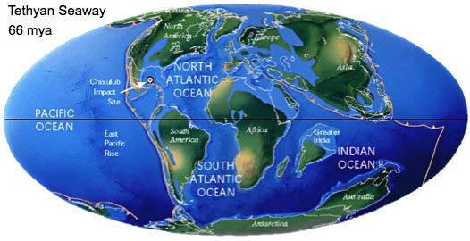
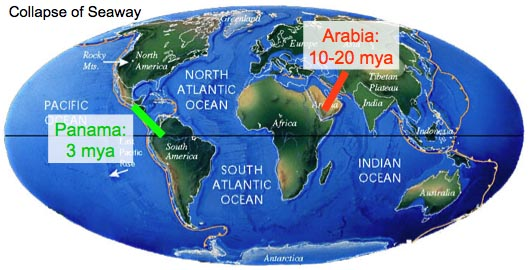
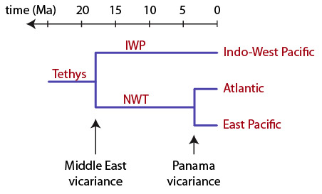

# GENE90018: Phylogenetics Workshop 1


The goals of this workshop are to:
- to get accustomed to data in text files and examine different file formats
- to get familiar with the phylogenetic software MEGA 
- to perform basic model selection
- to design and carry out a simple phylogenetic analysis


## Install the software you'll need
First, you need a good text editor to investigate the text files that serve as input and intermediates for phylogenetic analyses. Among many others, [SublimeText](https://www.sublimetext.com/) is a good option.

For alignment editing and phylogenetic inference we're going to be using MEGA (Molecular Evolutionary Genetics Analysis). Download the right version for your computer [here](https://www.megasoftware.net/) and install it on your system.

The MEGA software can be temperamental on Mac, so it's best to also install [AliView](https://ormbunkar.se/aliview/) as an alternative alignment editor. 

It's also recommended to have a good tree viewer like [FigTree](https://github.com/rambaut/figtree/releases).

We'll also be using IQ-Tree on the command line. Instructions for that are below in the command-line analyses section. If you can't get this to work on your machine, don't panic, you can also run IQ-Tree jobs online via [this link](http://iqtree.cibiv.univie.ac.at/).

Your Mac will likely complain about any software that's not downloaded from the App Store, but if you go into your System Preferences > Security & Privacy, you can overrule the warnings and use the software anyway.

## Case study
Across this week and next, we will be re-analyzing the dataset from:
> Malaquias MAE & Reid DG (2009) Tethyan vicariance, relictualism and speciation: evidence from a global molecular phylogeny of the opisthobranch genus *Bulla*. *Journal of Biogeography* 36: 1760-1777. DOI: [10.1111/j.1365-2699.2009.02118.x](https://doi.org/10.1111/j.1365-2699.2009.02118.x) 

The study focuses on *Bulla*, a genus of tropical and warm-temperate marine snails (Gastropoda).


The final goal of the study is to investigate whether historical vicariance events have led to the geographic partitioning of *Bulla* species. For geological context, here's what the large Tethyan Ocean looked like 66 Ma and how it fragmented into the ocean basins we know today:




This closure of the seaway leads to the following expectation of vicariance in the phylogeny:



What information do we have to address this goal?

- Phylogenetic dataset
  - Three genes (28S,16S,CO1)
  - Ten *Bulla* species and three outgroup taxa
- Geographic distribution of the species 
  - *B. arabica*: tropical Indo-West Pacific
  - *B. ampulla*: tropical Indo-West Pacific
  - *B. orientalis*: tropical Indo-West Pacific
  - *B. vernicosa*: tropical Indo-West Pacific
  - *B. quoyii*: temperate Australasia
  - *B. gouldiana*: temperate East Pacific
  - *B. punctulata*: tropical East Pacific
  - *B. mabillei*: subtropical Atlantic
  - *B. striata*: tropical Atlantic
  - *B. occidentalis*: tropical Atlantic
- Two *Bulla* fossils
  - oldest known fossil of genus *Bulla*: 40.4 Ma
  - oldest known fossil of *Bulla occidentalis-striata* species group: 20.4 Ma

So what are we going to do?

- Prepare the sequence data for analysis
- Model selection and phylogenetic analysis
- Molecular clock analysis (next week)
- Interpretation of the results

## Investigate the sequence data

Download the files containing sequence data from this GitHub repository.  

Locate the three FASTA files in the `1_alignment` directory (see at top of this page):
- `28S.noaln.fas`
- `16S.noaln.fas`
- `COI.noaln.fas`

Open one in your text editor and examine the structure of the file.


## Alignment of gene sequences

We're going to start by manually aligning the COI data.

Open the file `COI.noaln.fas` in MEGA's alignment editor
- Alignment > Edit/build alignment > Create a new alignment > DNA
- Click the "Open File" icon > Select file type FASTA > Open the file

Align the sequences
- Flick back and forth between "DNA Sequences" and "Translated Protein Sequences" tabs to help you understand the reading frames
- Insert dashes (-) to denote gap characters
- Save the resulting alignment
- Data > Export Alignment > FASTA Format

Alignments can be cropped to tidy up the 5' and 3' ends of genes where information may only be available for some of the species. (Note: This is somewhat of a Sanger sequencing-era thing, with HTS methods usually resulting in full length gene sequences.)
- Remove the 5' and 3' parts where only a few species have data
- Save the resulting alignment
- Data > Export Alignment > FASTA Format

For the other two genes, we'll play around with some automated alignment methods.

For online iterative alignment of 28S and 16S, head over to the MUSCLE web server at the European Bioinformatics Institute: http://www.ebi.ac.uk/Tools/msa/muscle/

Upload the file you want to align, choose FASTA for the output format, hit "Submit" and wait for the results to appear. You can save the output file to your computer (> Download Alignment File > Right Mouse Click > Save Page As).

Open one of the output files in your text editor and examine the structure of the file

MEGA alignment is particularly finicky on Mac, but for those running it on Windows, feel free to run a Muscle or ClustalW alignment in MEGA:
- Open the file ("Open File" icon > Select file type FASTA > Open the file)
- Align the sequences (Alignment > Align by Muscle)
- Export the result to fasta file

## Concatenation of the genes into a single alignment

Once you have the alignments of COI, 16S and 18S, you have the option of concatenating them together into a single alignment containing all of the phylogenetic information across those three genes.

See [here](https://www.megasoftware.net/web_help_11/index.htm#t=Concatenation_Utility.htm&rhsearch=concatenation&rhhlterm=concatenation&rhsyns=%20) for instructions on how to do this with MEGA. 

## Model selection

Open an alignment for analysis in the main MEGA window (click the Data icon > Open a file/session). If you have just concatenated data, those data will already be loaded. Alternatively, you can pick one of the aligned genes, or the concatenated alignment that is provided in the `2-modelsel` directory in the data repository you downloaded.

You can run model selection with the "Find best DNA/Protein models (ML)" under the Models icon. Feel free to go ahead with default settings.

Analyse the results table and determine which model is likely best to use for phylogenetic inference.

## Maximum likelihood phylogenetic inference

To infer a ML phylogeny, use the "Construct/Test Maximum Likelihood Tree" under the Phylogeny icon.

Consider the settings here for a moment. What choices are you going to make?

Have a look at the tree you get. Which branches are well supported and which are not?

## Command line analyses 

This section is optional. A demo will be given during the workshop, and the courageous should feel free to try this on their machine. 

In a research environment, most phylogenetic analyses are carried out with more advanced software that has many more analysis options but without a graphical user interface. These programs are controlled on the command line, and this section will give you some exposure to that. Note that most of the things we have done above online or in MEGA (e.g. multiple sequence alignment, concatenation) can be done easily and very rapidly with command line tools.

First, go learn more about what the command shell is and how to use it [here](https://datacarpentry.org/shell-genomics/).

Then go download the right version of IQ-Tree, one of the most advanced and well-documented maximum likelihood-based phylogeny inference tools, from [here](http://www.iqtree.org/), and unzip the archive.

To make it easy on yourself, copy the alignment you want to analyse into the folder containing the IQ-Tree executable. Then, in your terminal window, navigate to that folder. In my case:
```
cd /Users/hverbruggen/Downloads/iqtree-2.2.0-MacOSX/bin
```
To see all the options (and feel overwhelmed), show the help output:
```
./iqtree2 -h
```
IQ-Tree has an excellent and structured documentation page [here](http://www.iqtree.org/doc/).

We're just going to start with a simple run (see under Minimal command-line examples).
```
./iqtree2 -s concat.fas
```
Look at the screen output and figure out what's happened. What model of sequence evolution was used and why? Look at all the files that were created. Go find the tree file, open it in a text editor and analyse the structure. Then open it in a tree viewer software (e.g. MEGA, [FigTree](https://github.com/rambaut/figtree/releases)). Any interpretations on the biogeography yet?

When you're done with all that, find out how to infer a tree and calculate branch support for it. Decide on some alternative methods with your neighbours and compare results.

## Upgrading to analysing whole genomes

This section is optional. If there is time, a demo will be given of a genome-scale analysis using [OrthoFlow](https://github.com/rbturnbull/orthoflow), a workflow that takes care of nearly all intermediate steps automatically.