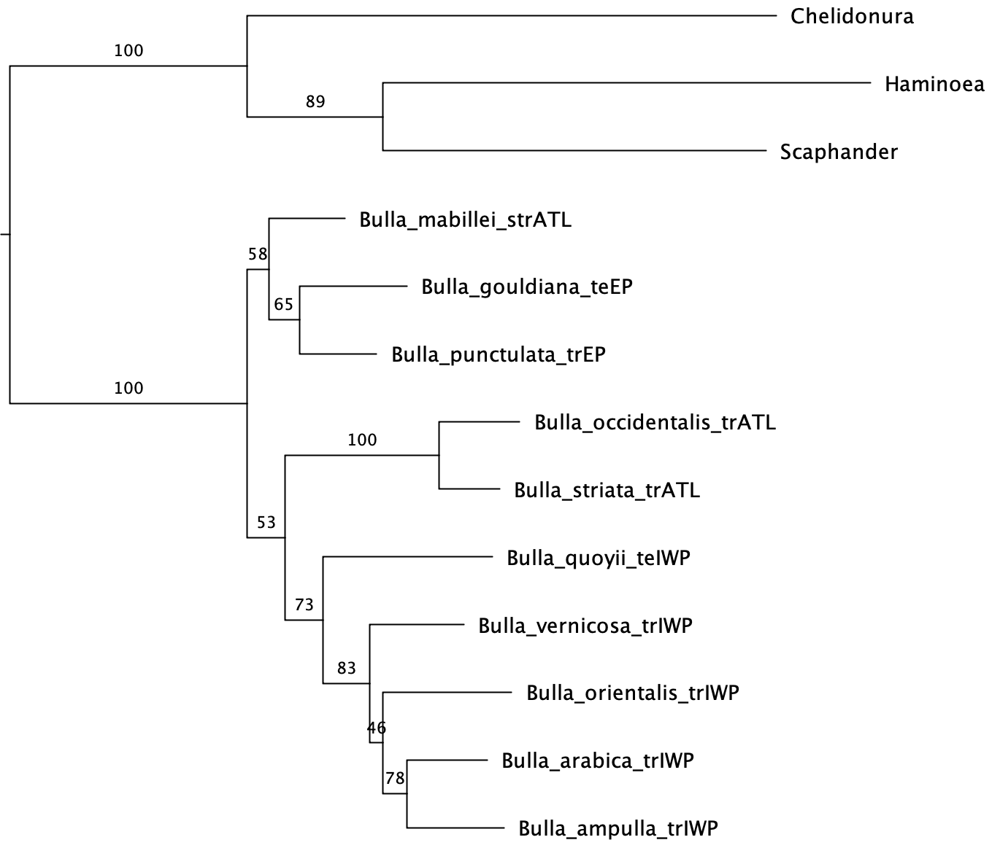

# GENE90018: Phylogenetics Workshop 1

The goals of this workshop are to:
- to get familiar with Bayesian phylogenetic inference
- to think about calibration of relaxed molecular clocks
- to set up an analysis in BEAUTI and analyse it in BEAST
- to interpret the results

## Install the software you'll need

Download BEAST 2.7.3 from [here](https://www.beast2.org/) and install it. You'll also need [Tracer](https://github.com/beast-dev/tracer/releases/latest). You'll already have [FigTree](https://github.com/rambaut/figtree/releases) or an equivalent tree viewer from last week.

## Case study

Look back to last week's documentation to remind you of the case study we're using...

## Set up a basic analysis

There are different programs with different functions in the BEAST package.
The first we will use is BEAUTi, which sets up the analysis settings and converts the sequence data into the XML format that BEAST uses. We'll start by setting up a simple analysis without fossil constraints.

In the `Partitions` tab, import the concatenated data matrix.

In the `Site model` tab, specify a suitable model based on what you learned about the data last week.

In the `Clock model` tab, specify the Optimised Relaxed Clock model. Check out the paper describing this model [here](https://doi.org/10.1371/journal.pcbi.1008322).

The `Priors` tab is where the interesting stuff happens.
- Since this is a dataset containing multiple species, a Yule or Birth-Death model should be picked for the tree prior.
- Check out some of the other priors. In the vast majority of cases, you probably don't want to change those from the defaults, but it's nice to know that you can.

Head over to the `MCMC` tab to specify the settings for the Markov chain.
- The default of 10 million generations is probably a bit generous for simple analyses like this one, so you can safely reduce that to, say, 1 million. For larger analyses you may want to keep this at 10M or even higher.
- Have a look at the trace and tree logging setup. No need to change anything, but good to know what it means and where to change it.

Now save the XML file based on these settings via the File menu.

Don't close the BEAUTi program yet, we'll need it again in a few minutes. 

Investigate the saved XML file in a text editor. This file is ready to run in BEAST. Feel free to go run it, or head into the next section to set up fossil calibrations.

## Incorporate calibration points

Remember that last week, these known fossils were given:
- oldest known fossil of genus *Bulla*: 40.4 Ma
- oldest known fossil of *Bulla occidentalis-striata* species group: 20.4 Ma

Think about how these fossils can be used to constrain node ages. Here's the ML tree from last week for guidance:

Determine which nodes have to be constrained. BEAUTi defines nodes in terms of most recent common ancestors (MRCAs), so keep note of which MRCA you want to constrain.

Go back to BEAUTi and add an MRCA prior to constrain an internal node. Select the taxa that define the MRCA. Via the triangle button, you can now tune the parameters of the prior distribution. Pick one that you think makes sense based on the information you have. Discuss with your peers. 

When you're done defining the constraints and other settings, save the XML and go run it in BEAST.

## Check and summarize BEAST results

The convergence of the BEAST run can be checked by opening the .log file in Tracer.

BEAST output trees are summarized with the program TreeAnnotator, which is part of the BEAST package.

Select the Input Tree File: this is the .trees file resulting from the BEAST analysis. Specify how many trees have to be discarded from the start as burn-in based on your assessment of the convergence of your run. Select Mean heights for the Node heights and specify a name for the output file (the consensus tree).

The output tree can now be opened with a tree editor (FigTree). Play with the visualization. Use node bars to indicate uncertainty. Add a scale axis and reverse it to better indicate time.

## Interpret the results

Are there indications for vicariance imprints in the tree? Do the node ages correspond to the expected ages? When did the temperate-water species diverge from the tropical ones?

## Taking it further

From a technical perspective, how might you improve on what you've done?

If there is a different group of organisms you need a time-calibrated tree for, where would you start?

To improve your ability to justify your choices, read [this paper](https://doi.org/10.1093/sysbio/syr107) about best practices for justifying fossils as well as [this one](https://doi.org/10.1093/sysbio/syp035) about prior choices.